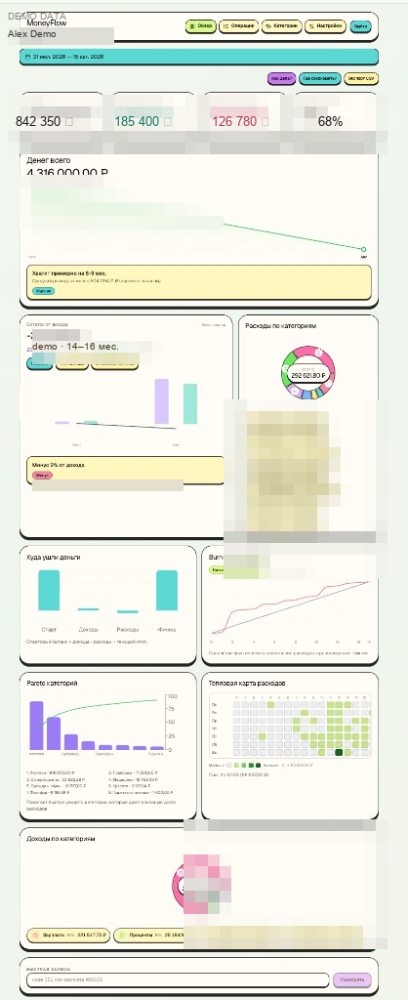
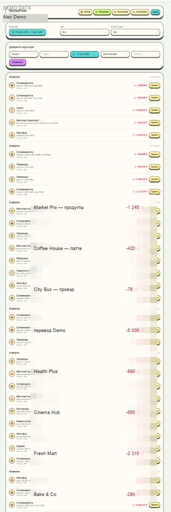
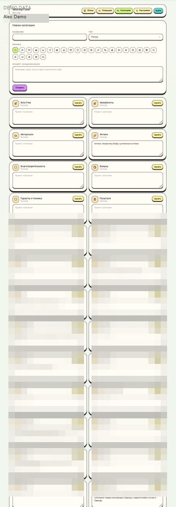

# MoneyFlow

Personal money tracker: Telegram bot (text / receipt photo / bank history screenshot) → RouterAI → SQLite → web dashboard.

## Screenshots

Demo DB only (fictional amounts and merchants, no personal data).

<p align="center">
  
  
  
</p>

## Stack

- `apps/api` — Hono + Drizzle + SQLite + grammY
- `apps/web` — React + Vite + Tailwind + Recharts (glass UI)
- `packages/shared` — Zod schemas

## Self-host (VPS)

One-liner on a Debian/Ubuntu VPS (root). The script installs Docker if needed, writes `/opt/moneyflow`, pulls `ghcr.io/dmitryshelomanov/moneyflow`, and starts the app plus Caddy.

```bash
bash <(curl -Ls https://raw.githubusercontent.com/dmitryshelomanov/moneyflow/main/install.sh)
```

Read the script before running it. The GHCR package must be **public** or `docker pull` will fail.

### What you need

- Debian or Ubuntu, root (`sudo`)
- Ports **80** and **443** open (firewall / security group)
- Optional: [Telegram bot token](https://t.me/BotFather), your numeric Telegram user id, [RouterAI](https://routerai.ru/) key
- For HTTPS: your own TLS files (see below). The installer does **not** issue certificates.

The script prompts for domain (or IP), bot token, allowed Telegram ids, RouterAI key. `ACCESS_KEY` and `SESSION_SECRET` are generated unless you set them.

After install with a domain, attach that hostname to the bot in BotFather if you want **web** Telegram login. The bot in chat works without a domain.

### Certificates

Put them here yourself (Let’s Encrypt via certbot, Cloudflare origin cert, whatever you use):

```text
/opt/moneyflow/certs/fullchain.pem
/opt/moneyflow/certs/privkey.pem
```

Symlinks to `/etc/letsencrypt/live/<domain>/` work. If these files are missing, Caddy listens on **:80 only**. After you drop the files in, run `/opt/moneyflow/install.sh update` to enable HTTPS.

Bare IP → HTTP only, no Telegram web OAuth.

### What lives where

The image is only the app. Secrets, the database, and TLS files stay on the host:

| Path                    | Contents                                            |
| ----------------------- | --------------------------------------------------- |
| `/opt/moneyflow/.env`   | tokens, `ACCESS_KEY`, `SESSION_SECRET`              |
| `/opt/moneyflow/data/`  | SQLite (`moneyflow.db`)                             |
| `/opt/moneyflow/certs/` | `fullchain.pem` + `privkey.pem` (you provide these) |

Dashboard URL is printed at the end: `https://<domain>/k/<ACCESS_KEY>/` (or `http://<ip>/k/<ACCESS_KEY>/`).

### Later

```bash
/opt/moneyflow/install.sh update
/opt/moneyflow/install.sh reconfigure
/opt/moneyflow/install.sh uninstall          # stop containers, keep SQLite and certs
/opt/moneyflow/install.sh uninstall --purge  # also delete /opt/moneyflow
```

Pin a release with `GITHUB_REF=v0.1.0`. Existing `npm run deploy` (rsync from your laptop, same `certs/` layout) is unchanged; see [Deploy on a VPS](#deploy-on-a-vps).

## Quick start

```bash
cp .env.example .env
# fill ACCESS_KEY, SESSION_SECRET; for the bot — TELEGRAM_BOT_TOKEN, ALLOWED_TELEGRAM_IDS
# for AI — ROUTERAI_API_KEY

npm install
npm run build -w @moneyflow/shared
npm run dev:api
npm run dev:web
```

Open: `http://localhost:5173/k/<ACCESS_KEY>/`

In development (without Telegram OAuth setup) use the **Sign in (dev)** button.

`WEB_ORIGIN` is used in the bot `/start` greeting as the web link. On a VPS set it to your public URL, e.g. `https://money.example.com`.

## Optional pre-commit guard

To block accidental commits of `.db` files and secrets:

```bash
npm run hook:install
```

The hook checks staged files/diff and rejects commits containing:

- database files (`*.db`, `*.sqlite`)
- sensitive env files (`env.prod`, `.env*`, except examples)
- likely secrets in added lines (tokens/keys/password-like assignments)

## Auth

Two layers: hidden URL + Telegram login (whitelist).

```text
  Browser
     │
     ▼
  /k/<ACCESS_KEY>/          ← wrong/missing key = 404 (site “does not exist”)
     │
     ▼
  Login page
     │
     ├─ Production: Telegram OAuth button
     │     → POST /auth/telegram
     │     → hash check with bot token
     │     → id ∈ ALLOWED_TELEGRAM_IDS
     │
     └─ Development: “Sign in (dev)” button
           → POST /auth/dev-login
           → id from whitelist (or 1)
     │
     ▼
  Cookie mf_session (HttpOnly, 30 days, HMAC via SESSION_SECRET)
     │
     ▼
  Dashboard / API — every request needs the cookie
     missing cookie / foreign id → 401
```

| Step         | What happens                                                            |
| ------------ | ----------------------------------------------------------------------- |
| 1. URL       | `ACCESS_KEY` must be in the path. One shared key for the whole project. |
| 2. Login     | Telegram proves identity (or dev-login locally).                        |
| 3. Whitelist | Only `user_id`s from `ALLOWED_TELEGRAM_IDS` can enter.                  |
| 4. Session   | Server sets a signed `mf_session` cookie.                               |
| 5. API       | No valid cookie → no data. Logout clears the cookie.                    |

The bot uses the same whitelist: outsiders get “Access denied”.

For Telegram Login on the web, production derives the numeric bot id from `TELEGRAM_BOT_TOKEN` (or `TELEGRAM_BOT_ID`). Attach your domain to login in [BotFather](https://t.me/BotFather). Local Vite still uses `VITE_TELEGRAM_BOT_ID`.

## API

Base prefix:

```text
/k/<ACCESS_KEY>/api/...
```

Almost every route (except login / me / logout) requires the `mf_session` cookie.

### Ops

| Method | Path      | Description                        |
| ------ | --------- | ---------------------------------- |
| `GET`  | `/health` | Healthcheck **without** access key |

### Auth

| Method | Path                  | Auth            | Description                               |
| ------ | --------------------- | --------------- | ----------------------------------------- |
| `POST` | `/api/auth/telegram`  | —               | Sign in via Telegram OAuth payload        |
| `POST` | `/api/auth/dev-login` | —               | Dev sign-in (`NODE_ENV=development` only) |
| `POST` | `/api/auth/logout`    | —               | Clear cookie                              |
| `GET`  | `/api/auth/me`        | cookie optional | Current user or `null`                    |

### Settings

| Method  | Path            | Description                                   |
| ------- | --------------- | --------------------------------------------- |
| `GET`   | `/api/settings` | Currency, opening balance, prompt, AI model   |
| `PATCH` | `/api/settings` | Update settings (incl. Telegram ID whitelist) |

### Categories

| Method   | Path                  | Description         |
| -------- | --------------------- | ------------------- |
| `GET`    | `/api/categories`     | List all categories |
| `POST`   | `/api/categories`     | Create              |
| `PATCH`  | `/api/categories/:id` | Update              |
| `DELETE` | `/api/categories/:id` | Delete              |

### Transactions

| Method   | Path                    | Description        |
| -------- | ----------------------- | ------------------ |
| `GET`    | `/api/transactions`     | Paginated list     |
| `GET`    | `/api/transactions/:id` | Single transaction |
| `POST`   | `/api/transactions`     | Create manually    |
| `PATCH`  | `/api/transactions/:id` | Update             |
| `DELETE` | `/api/transactions/:id` | Delete             |

`GET /api/transactions` query params: `from`, `to`, `type`, `categoryId`, `q`, `limit`, `cursor`.  
Response shape: `{ items, nextCursor, hasMore }`.

### Stats

| Method | Path                                         | Description                                        |
| ------ | -------------------------------------------- | -------------------------------------------------- |
| `GET`  | `/api/stats/summary?from&to`                 | Balance, period income/expense, category breakdown |
| `GET`  | `/api/stats/timeseries?from&to&granularity=` | Series: `day` \| `week` \| `month`                 |

### AI parse

| Method | Path         | Description                                                                                                      |
| ------ | ------------ | ---------------------------------------------------------------------------------------------------------------- |
| `POST` | `/api/parse` | Parse text and/or image. Body: `{ text?, imageBase64?, imageMime?, save? }`. `save: false` — JSON only, no write |

Route code: [`apps/api/src/routes/api.ts`](apps/api/src/routes/api.ts)

### Examples

```bash
KEY=your-access-key
BASE=http://localhost:3000/k/$KEY/api

# Dev login (stores cookie in jar)
curl -c cookies.txt -X POST "$BASE/auth/dev-login" \
  -H 'Content-Type: application/json' \
  -d '{"name":"Dev"}'

# Summary
curl -b cookies.txt "$BASE/stats/summary"

# Quick entry via AI
curl -b cookies.txt -X POST "$BASE/parse" \
  -H 'Content-Type: application/json' \
  -d '{"text":"coffee 350"}'
```

## Env

| Variable               | Description                                                                       |
| ---------------------- | --------------------------------------------------------------------------------- |
| `ACCESS_KEY`           | Secret URL segment (see below)                                                    |
| `SESSION_SECRET`       | Cookie signing key (see below)                                                    |
| `TELEGRAM_BOT_TOKEN`   | Bot token (production also derives the numeric bot id from it)                    |
| `TELEGRAM_BOT_ID`      | Optional numeric bot id override for web OAuth                                    |
| `ALLOWED_TELEGRAM_IDS` | Comma-separated Telegram user id whitelist                                        |
| `ROUTERAI_API_KEY`     | [RouterAI](https://routerai.ru/) key                                              |
| `ROUTERAI_MODEL`       | Vision-capable model, e.g. `openai/gpt-4o`                                        |
| `DATABASE_PATH`        | SQLite path                                                                       |
| `PORT`                 | API port                                                                          |
| `WEB_ORIGIN`           | CORS origin + bot link (dev: `http://localhost:5173`, VPS: `https://your.domain`) |
| `VITE_TELEGRAM_BOT_ID` | Dev-only bot id for Vite; production uses `TELEGRAM_BOT_ID` / token               |

### What `ACCESS_KEY` and `SESSION_SECRET` do

**`ACCESS_KEY`** — an “invisible door” in the URL.

- The app only opens at  
  `http://x.x.x.x/k/<ACCESS_KEY>/` (or a domain once you have one)  
  (local: `http://localhost:5173/k/<ACCESS_KEY>/`).
- The API lives under the same prefix: `/k/<ACCESS_KEY>/api/...`.
- Wrong key → `404`. Someone who only knows the host never sees the site.
- Not a full password — URL obscurity. Together with the Telegram whitelist this is enough for a personal project.
- In production use a long random string (16+ chars) and don’t share the link.

**`SESSION_SECRET`** — secret used to sign the cookie after login.

- After Telegram login (or dev-login) the server sets an HttpOnly `mf_session` cookie.
- The cookie is HMAC-signed with this secret: forging a session without it is not possible.
- Changing `SESSION_SECRET` invalidates all current sessions (users must sign in again).
- In production use another long random string, **different** from `ACCESS_KEY`.

Generate examples:

```bash
openssl rand -hex 16   # ACCESS_KEY
openssl rand -hex 32   # SESSION_SECRET
```

## Deploy on a VPS

Local script: online SQLite dump (unless skipped) → rsync over SSH → write `.env` on the server → remote preflight checks (`docker`, `docker compose`, TLS certs in `certs/`, path permissions) → `docker compose up -d --build --remove-orphans` → post-deploy verification (app + Caddy on **HTTPS :443**, HTTP fallback **:80**). Schema is created on app boot (`CREATE TABLE IF NOT EXISTS`).

Public URL: `https://<DOMAIN>/k/<ACCESS_KEY>/`  
Healthcheck: `https://<DOMAIN>/health`  
HTTP fallback: `http://<SERVER_IP>/health`

### Once on the VPS

1. Ubuntu/Debian, Docker + Compose plugin, host ports **443** (HTTPS) and **80** (HTTP fallback) open.
2. Deploy user with an SSH key (public key in `~/.ssh/authorized_keys`).
3. Directory, e.g. `/opt/moneyflow` (created by the deploy script).
4. TLS files at `/opt/moneyflow/certs/fullchain.pem` and `privkey.pem` (symlinks to your Let’s Encrypt live certs; not in git). Deploy requires these files.

### Local deploy config

```bash
cp env.prod.example env.prod
# fill DEPLOY_* and app secrets (env.prod is gitignored)
# put the private key at .deploy-keys/moneyflow_deploy (also gitignored)

npm run deploy
# or: ./scripts/deploy.sh
```

| Variable                               | Example                                        |
| -------------------------------------- | ---------------------------------------------- |
| `DEPLOY_HOST`                          | Server IP                                      |
| `DEPLOY_USER`                          | `deploy`                                       |
| `DEPLOY_PATH`                          | `/opt/moneyflow`                               |
| `DEPLOY_SSH_KEY`                       | `.deploy-keys/moneyflow_deploy`                |
| `DEPLOY_SSH_PORT`                      | `22`                                           |
| `WEB_ORIGIN`                           | `https://your.domain`                          |
| `ACCESS_KEY`                           | yes (≥8)                                       |
| `SESSION_SECRET`                       | yes (≥8)                                       |
| `TELEGRAM_BOT_TOKEN`                   | for the bot                                    |
| `ALLOWED_TELEGRAM_IDS`                 | whitelist                                      |
| `TELEGRAM_BOT_ID`                      | optional; otherwise derived from the bot token |
| `VITE_TELEGRAM_BOT_ID`                 | optional; still accepted as a fallback         |
| `ROUTERAI_API_KEY`                     | for AI                                         |
| `ROUTERAI_BASE_URL` / `ROUTERAI_MODEL` | optional                                       |

`NODE_ENV`, `PORT`, `DATABASE_PATH` are set by the script when uploading `.env`.

### Post-deploy checks

After deploy, the script verifies:

- `docker compose ps` output on the server
- running `app` container state/image via `docker inspect`
- internal app health from inside the container (`http://127.0.0.1:3000/health`)
- external health endpoint from your machine (`$WEB_ORIGIN/health`) with retries

### Database dump & restore

Uses the same `env.prod` / `DEPLOY_*` SSH settings as deploy. Dumps are consistent online backups via `better-sqlite3` (safe while the app is running / under WAL).

**Dump** (also runs automatically before each deploy unless `SKIP_PRE_DEPLOY_BACKUP=1`):

```bash
npm run db:dump
# or: ./scripts/dump-db.sh
```

- Creates a remote temp backup, downloads it to `data/dumps/moneyflow-YYYYMMDD-HHMMSS.db`
- Keeps the newest `KEEP_DUMPS` files (default `14`); set `LOCAL_DUMP_DIR` to change the folder

**Restore** (replaces remote `data/moneyflow.db`):

```bash
npm run db:restore -- data/dumps/moneyflow-YYYYMMDD-HHMMSS.db
# or: ./scripts/restore-db.sh /path/to/moneyflow-….db
```

1. Asks for confirmation (`YES`), or skip with `FORCE_RESTORE=1`
2. Uploads the dump, backs up the current remote DB to `data/pre-restore-….db`
3. Stops `app`, removes leftover `moneyflow.db-wal` / `.db-shm`, swaps the database file, starts `app` again and waits for health

Dump/restore files under `data/` are local/remote ops artifacts — keep them out of git (the pre-commit hook rejects `*.db`).

### Auth without a domain

| Channel                  | Works on bare IP?                                |
| ------------------------ | ------------------------------------------------ |
| Telegram bot (chat)      | Yes                                              |
| Web Telegram OAuth login | No (needs hostname in BotFather + usually HTTPS) |
| Dev-login                | No in `NODE_ENV=production`                      |

Use the **bot** for auth on bare IP (cert may not match the IP hostname).

### Run compose on the server only

From a git checkout (builds the image locally; `ACCESS_KEY` is a runtime env, not a build-arg):

```bash
cp .env.example .env
# ACCESS_KEY, SESSION_SECRET, WEB_ORIGIN=https://your.domain, …
docker compose up -d --build
```

Or pull the published image with [deploy/docker-compose.yml](deploy/docker-compose.yml) (this is what `install.sh` uses).

Manual start without Docker:

```bash
npm install
npm run build
NODE_ENV=production npm start
```

The bot starts polling in the same process as the API.

## MVP features

- Parse text, receipts, and bank history screenshots (photos are not stored; list → N transactions, receipt → one)
- Categories with a Lucide icon and an optional prompt
- Global categorization prompt in settings
- Balance = opening + income − expenses
- Income/expense charts and spend structure
- Transaction filters by date / type / category
